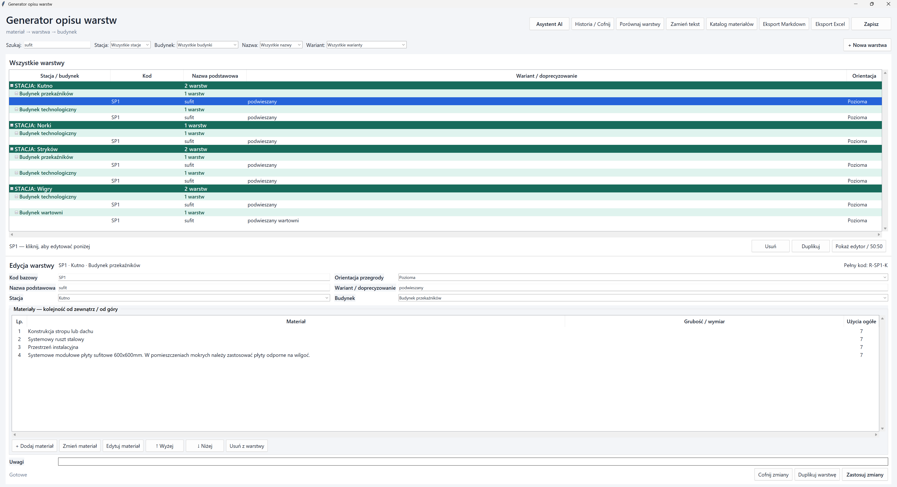
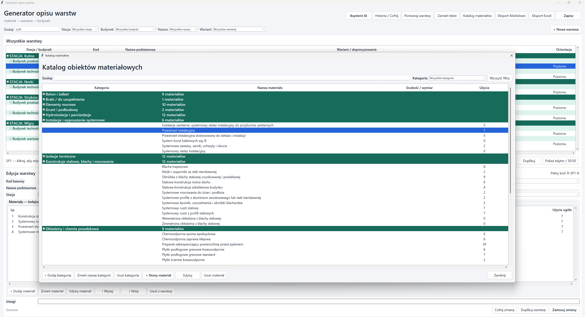
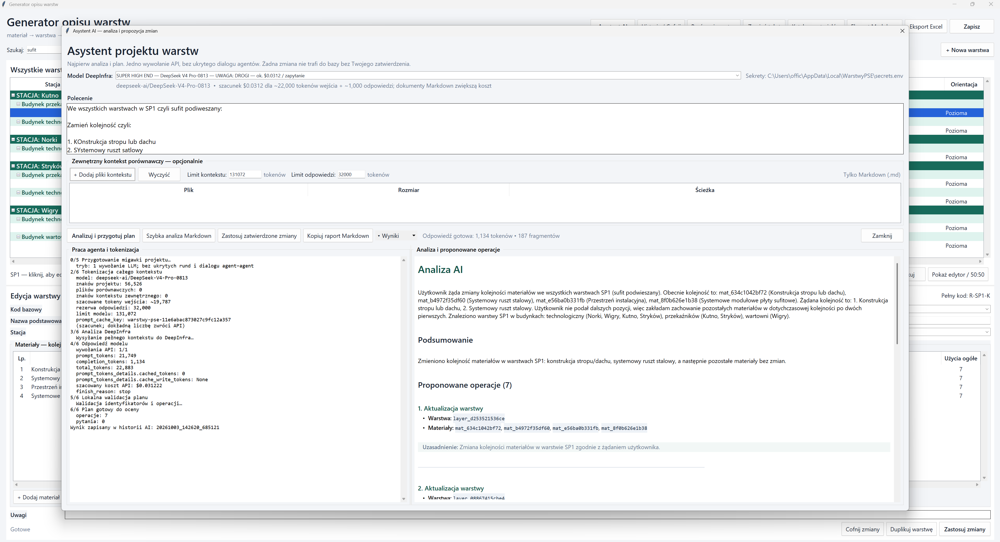
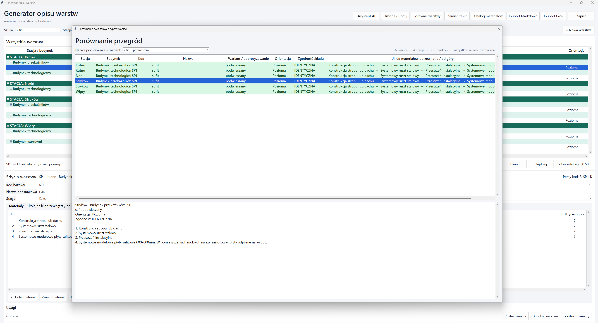

# Generator opisów przegród

**Aplikacja desktopowa · BIM / automatyzacja dokumentacji technicznej · Python**

Narzędzie porządkuje opisy przegród budowlanych w strukturze **materiał → warstwa → budynek i lokalizacja**. Ułatwia ponowne używanie materiałów, porównywanie rozwiązań między obiektami i przygotowanie spójnych zestawień.

## Funkcje

- Katalog materiałów z kategoriami, grubością i osobnym parametrem przewodności cieplnej λ.
- Edytor układu warstw z kolejnością materiałów, orientacją przegrody i osobnym parametrem U.
- Wyszukiwanie, filtrowanie oraz porównywanie układów przegród między budynkami i lokalizacjami.
- Eksport do Markdown z niezależnymi opcjami dołączania U i λ oraz eksport bazy do Excel.
- Automatyczny zapis, historia zmian i walidacja danych. Opcjonalny asystent AI proponuje zmiany, które wymagają zatwierdzenia użytkownika.

## Przykład eksportu Markdown

```md
### R-DT1-K – stropodach na blasze trapezowej, U=0,20
1. Wełna mineralna – 300 mm, lambda=0,035.
2. Folia paroizolacyjna.
3. Blacha trapezowa.
```

**Technologie:** Python 3.10+, Tkinter, JSON, XLSX, Markdown; opcjonalnie DeepInfra API.

Repozytorium prezentuje projekt w portfolio. Kod aplikacji i dane projektowe nie są publikowane.











